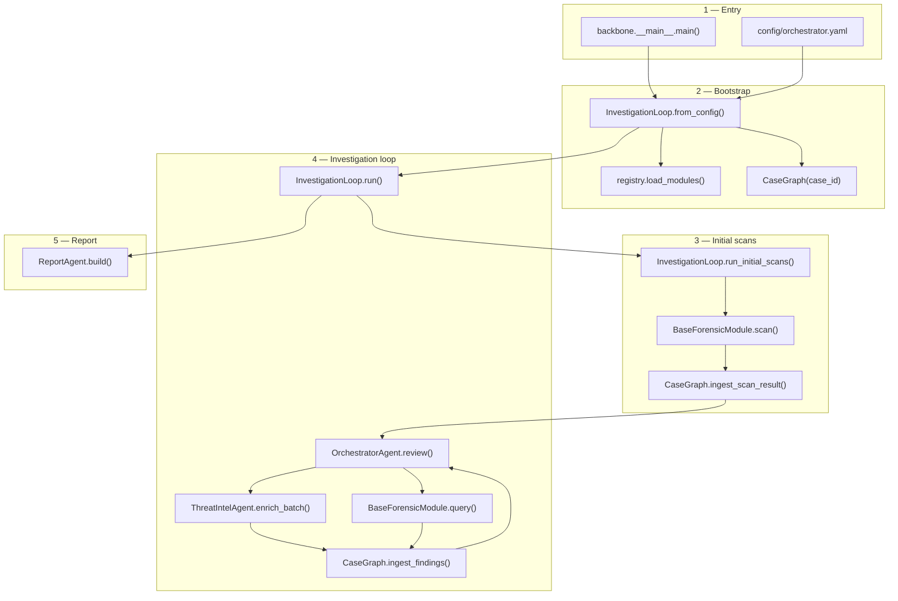

# Backbone Architecture

How the orchestration layer works, step by step, with links to the code for each part.

For how to build a pluggable model see [`../models/README.md`](../models/README.md).

---

## System overview

```
┌─────────────────────────────────────────────────────────────────┐
│                         BACKBONE                                 │
│  CLI → InvestigationLoop → CaseGraph ← agents (orch / TI / report)│
└────────────┬───────────────────────────────────────┬────────────┘
             │ in-process calls                      │
             ▼                                       ▼
   ┌──────────────────┐                    ┌──────────────────┐
   │  models/disk     │                    │  Threat Intel    │
   │  models/ram      │                    │  (VT, AbuseIPDB) │
   │  models/network  │                    └──────────────────┘
   └──────────────────┘
        inherit BaseForensicModule
```

**Batch model:** each module finishes its full scan before the orchestrator reviews all results. Follow-up pivots use `EntityQuery` → `EntityFindings` in later loop rounds.

---

## End-to-end flow



| Step | Description |
|------|-------------|
| 1–2 | CLI bootstrap via `main()` → `from_config()` → `run()` |
| 3 | `run()` → `run_initial_scans()` → graph seed |
| 4 | `run()` — orchestrator review, TI, query loop |
| 5 | `ReportAgent.build()` at loop termination |

---

## Step 1 — CLI entry

**Command:** `python -m backbone run --case-id <id> [--config path]`

| Item | Location |
|------|----------|
| CLI parser | [`backbone/__main__.py`](backbone/__main__.py) → `main()` |
| `run` subcommand | creates `InvestigationLoop.from_config()` then calls `loop.run()` |
| Package version | [`backbone/__init__.py`](backbone/__init__.py) → `__version__` |

---

## Step 2 — Bootstrap

**Function:** `InvestigationLoop.from_config(config_path, case_id=...)`

| What happens | File | Symbol |
|--------------|------|--------|
| Load YAML config | [`backbone/orchestrator/loop.py`](backbone/orchestrator/loop.py) | `InvestigationLoop.from_config()` |
| Example config | [`config/orchestrator.example.yaml`](config/orchestrator.example.yaml) | `case`, `modules`, `threat_intel`, `report` |
| Import module classes | [`backbone/registry.py`](backbone/registry.py) | `load_modules()` → `import_module_class()` |
| Create empty case graph | [`backbone/case_graph.py`](backbone/case_graph.py) | `CaseGraph(case_id)` |
| Create orchestrator agent | [`backbone/orchestrator/agent.py`](backbone/orchestrator/agent.py) | `OrchestratorAgent(use_llm=...)` |

**Config shape for modules:**

```yaml
modules:
  - class: models.disk.disk_module.DiskModule   # must inherit BaseForensicModule
    kwargs:
      artifact_dir: "..."
```

**Registry checks:** imported class must be a subclass of `BaseForensicModule`; duplicate `module_id` values are rejected.

---

## Step 3 — Initial scans

**Called from:** `InvestigationLoop.run()` → `asyncio.run(run_initial_scans())`

### 3a — Orchestrator calls every module

| Item | Location |
|------|----------|
| Parallel scan dispatch | [`backbone/orchestrator/loop.py`](backbone/orchestrator/loop.py) → `run_initial_scans()` |
| Uses | `asyncio.gather(*[module.scan(case_id) for module in modules.values()])` |

### 3b — Inside each forensic module

Each model under [`../models/`](../models/) **must inherit** [`BaseForensicModule`](backbone/contracts/base_model.py):

| Method | Returns | Schema |
|--------|---------|--------|
| `scan(case_id)` | `ModuleScanResult` | [`schemas/module_scan_result.schema.json`](schemas/module_scan_result.schema.json) |
| `query(query)` | `EntityFindings` | [`schemas/entity_findings.schema.json`](schemas/entity_findings.schema.json) |

**Internal module pipeline** (lives in each model, not in Backbone):

```
Collector → Triage Agent → Pivot Agent → scan() bundles ScanFinding[]
```

Reference disk implementation: [`../models/Disk/`](../models/Disk/).

**Test stub:**

| Item | Location |
|------|----------|
| Stub module | [`backbone/dev/stub_module.py`](backbone/dev/stub_module.py) → `StubModule` |
| Validates output | `BaseForensicModule.validate_scan_result()` |

### 3c — Ingest into case graph

| Item | Location |
|------|----------|
| Ingest scan | [`backbone/case_graph.py`](backbone/case_graph.py) → `CaseGraph.ingest_scan_result()` |
| Creates nodes | `get_or_create_node()` for each `primary_entity` and `related_entities` |
| Stores raw scan | `CaseGraph.initial_scans[module_id]` |
| Node type | `EntityNode` — holds `findings[]`, `queried_modules`, `related[]` |

**Typed payloads:** [`backbone/contracts/types.py`](backbone/contracts/types.py) → `ModuleScanResult`, `ScanFinding`, `Entity`, `RelatedEntity`.

---

## Step 4 — Investigation loop

**Called from:** `InvestigationLoop.run()` (after `run_initial_scans()` completes).

The orchestrator agent reviews the graph and drives follow-ups until convergence (`max_rounds` or no new entities).

### 4a — Orchestrator agent review

| Item | Location |
|------|----------|
| Agent class | [`backbone/orchestrator/agent.py`](backbone/orchestrator/agent.py) → `OrchestratorAgent.review()` |
| LLM prompt | [`prompts/orchestrator.md`](prompts/orchestrator.md) |
| Reads | `CaseGraph.summary_for_agent()` — compact hot-entity view |
| Produces | `follow_up_queries: list[EntityQuery]` |

**Graph summary helper:** [`backbone/case_graph.py`](backbone/case_graph.py) → `CaseGraph.summary_for_agent(limit=30)`.

### 4b — Threat Intel enrichment

| Item | Location |
|------|----------|
| Agent class | [`backbone/threat_intel/agent.py`](backbone/threat_intel/agent.py) → `ThreatIntelAgent.enrich_batch()` |
| Prompt | [`prompts/threat_intel.md`](prompts/threat_intel.md) |
| Input | batch of `Entity` dicts from new graph nodes |
| Output | `list[EntityFindings]` with `responding_module: "ti"` |
| Merge | `CaseGraph.ingest_findings()` |

### 4c — Cross-module pivots

Orchestrator builds an `EntityQuery` per follow-up:

| Field | Purpose |
|-------|---------|
| `query_id` | UUID v4 — orchestrator generates, module echoes in response |
| `entity` | What to look up (type + value) |
| `context.reason` | Pivot Agent reads this — what answer is wanted |
| `context.source_finding_id` | Links back to scan finding (e.g. `disk-mft-f001`) |

| Item | Location |
|------|----------|
| Query schema | [`schemas/entity_query.schema.json`](schemas/entity_query.schema.json) |
| Query types | [`backbone/contracts/types.py`](backbone/contracts/types.py) → `EntityQuery` |
| Validate query | [`backbone/contracts/validate.py`](backbone/contracts/validate.py) → `validate_query()` |
| Module answers | `BaseForensicModule.query(query)` |
| Ingest response | `CaseGraph.ingest_findings()` |

**Termination (config):** `case.max_rounds`, `case.max_queries_per_round` in [`config/orchestrator.example.yaml`](config/orchestrator.example.yaml).

---

## Step 5 — Final report

| Item | Location |
|------|----------|
| Agent class | [`backbone/report/agent.py`](backbone/report/agent.py) → `ReportAgent.build()` |
| LLM prompt | [`prompts/report.md`](prompts/report.md) |
| Inputs | `CaseGraph` (findings, evidence lines, entity graph from scans and pivots) |
| Output | `report.md` under `case.output_dir` |

---

## Contracts layer

All cross-component messages are JSON validated against schemas in [`schemas/`](schemas/).

| Envelope | Direction | Python type | Validator |
|----------|-----------|-------------|-----------|
| `ModuleScanResult` | module → orchestrator | `ModuleScanResult` | `validate_scan_result()` |
| `EntityQuery` | orchestrator → module | `EntityQuery` | `validate_query()` |
| `EntityFindings` | module / TI → orchestrator | `EntityFindings` | `validate_findings()` |

| Item | Location |
|------|----------|
| Type aliases | [`backbone/contracts/types.py`](backbone/contracts/types.py) |
| Validation | [`backbone/contracts/validate.py`](backbone/contracts/validate.py) |
| Public exports | [`backbone/contracts/__init__.py`](backbone/contracts/__init__.py) |
| Module base class | [`backbone/contracts/base_model.py`](backbone/contracts/base_model.py) → `BaseForensicModule` |

Modules call `validate_scan_result()` / `validate_findings()` via the base class before returning.

---

## Case graph (orchestrator memory)

The graph is **internal to Backbone**. Modules never see it.

```
EntityNode (type, value)
  ├── findings[]     ← scan + query results attached here
  ├── related[]      ← edges from related_entities
  ├── queried_modules
  └── first_seen_module / first_seen_finding_id
```

| Operation | When | Method |
|-----------|------|--------|
| Seed from scans | Step 3 | `ingest_scan_result()` |
| Merge pivot / TI | Step 4 | `ingest_findings()` |
| LLM context | Steps 4–5 | `summary_for_agent()` |
| Audit export | End of case | `to_dict()` → `case_state.json` |

---

## File map

```
Backbone/
├── ARCHITECTURE.md          ← this document
├── README.md
├── config/
│   └── orchestrator.example.yaml
├── schemas/                 ← JSON ground truth
├── prompts/                 ← LLM system prompts
├── backbone/
│   ├── __main__.py          main()           CLI entry
│   ├── registry.py          load_modules()   plugin loader
│   ├── case_graph.py        CaseGraph        investigation memory
│   ├── contracts/
│   │   ├── base_model.py    BaseForensicModule
│   │   ├── types.py         TypedDict payloads
│   │   └── validate.py      schema validation
│   ├── orchestrator/
│   │   ├── loop.py          InvestigationLoop  pipeline driver
│   │   └── agent.py         OrchestratorAgent  LLM reviewer
│   ├── threat_intel/
│   │   └── agent.py         ThreatIntelAgent
│   ├── report/
│   │   └── agent.py         ReportAgent
│   └── dev/
│       └── stub_module.py   StubModule        test double
└── tests/
    ├── test_case_graph.py
    └── test_registry.py
```

---

## Tests

| Test file | What it covers |
|-----------|----------------|
| [`tests/test_case_graph.py`](tests/test_case_graph.py) | `CaseGraph.ingest_scan_result()` seeds nodes |
| [`tests/test_registry.py`](tests/test_registry.py) | `load_modules()`, `StubModule`, `BaseForensicModule` inheritance |

Run from `Backbone/` with a local venv:

```bash
pip install -e ".[dev]"
pytest -q
```
