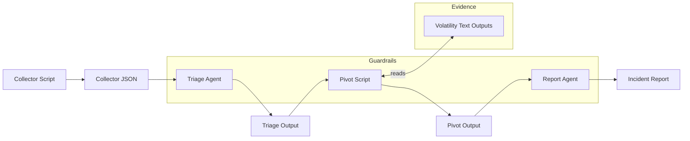

# Architecture

```mermaid
flowchart LR
  A[Collector Script]
  B[Collector JSON]
  C[Triage Agent]
  D[Triage Output]
  E[Pivot Script]
  F[Pivot Output]
  G[Report Agent]
  H[Incident Report]

  A --> B
  B --> C
  C --> D
  D --> E
  E --> F
  F --> G
  G --> H

  subgraph Guardrails
    C
    E
    G
  end

  subgraph Evidence
    X[Volatility Text Outputs]
  end

  E <-- reads --> X
```

Guardrails:
- Collector and pivot steps are deterministic.
- Raw evidence files are read-only.
- Agents consume only filtered data.
