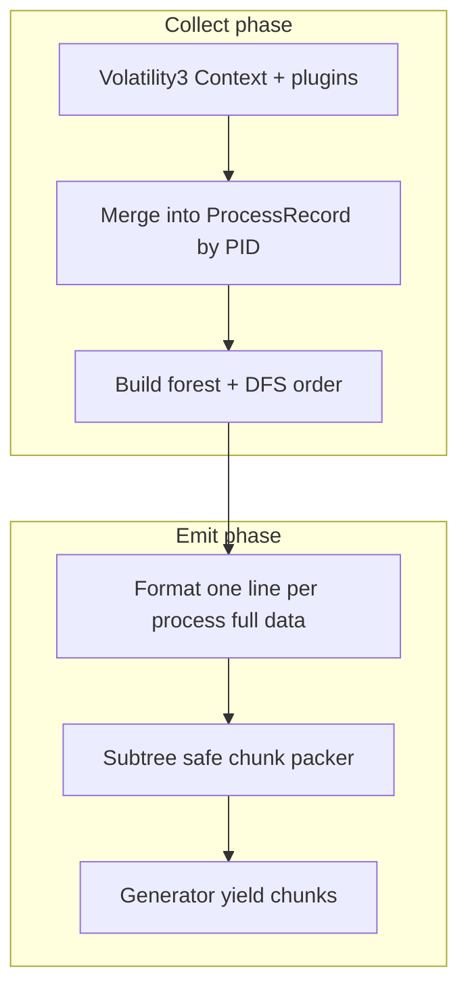

# Collector module (Volatility 3 + subtree-safe streaming chunks)

## Goals

- New package at repo root: `[collector/](collector/)` (sibling of `[backend_dummy/](backend_dummy/)` and `[frontend/](frontend/)`).
- **Input**: path to a Windows memory image (raw/mem/vmem/dmp) + optional explicit profile/symbols.
- **Process model**: aggregate Volatility 3 plugin outputs keyed by **PID** into one rich record per process (aligned with your schema on line 21 in `[ideas](ideas)`; implementation will use **full** `cmd`, full `dlls`, full `handles`, etc. — no truncation).
- **Ordering**: DFS pre-order over the **process tree** built from `PPID`/`PID` links, with **2 spaces per depth** prefix so parent-child is visible **and** `PID`/`PPID` remain on every line.
- **Streaming chunks**: public API yields **chunk strings** (or chunk objects) **one after another** without loading the full concatenated report in memory if possible (emit each chunk from a generator).
- **Chunk policy**: never split **between a parent line and any line in that parent’s descendant subtree**. Chunk boundaries may occur only **after a complete subtree** in DFS order (your A/B/C vs D/E example: chunk ends after **subtree(C)** before peers **D/E** at the same forest level, or after any completed subtree when packing by token budget).

## Architecture

### Volatility 3 plugin set (MVP, Windows)

Implement a thin orchestration layer that runs (in dependency-aware order, errors logged per plugin):

| Data                | Plugin(s)                                                           |
| ------------------- | ------------------------------------------------------------------- |
| Base list + PPID    | `windows.pslist.PsList`                                             |
| Tree sanity / Name  | `windows.pstree.PsTree` (optional, for name/ordering corroboration) |
| Command line        | `windows.cmdline.CmdLine`                                           |
| DLLs (full, no cap) | `windows.dlllist.DllList`                                           |
| Handles (full)      | `windows.handles.Handles`                                           |
| Privileges          | `windows.privileges.Privs`                                          |
| Network             | `windows.netscan.NetScan` or fallback `windows.netstat.NetStat`     |
| SIDs                | `windows.getsids.GetSIDs`                                           |

**Note:** Some plugins are expensive on large images; the design should still **stream chunks** of *formatted output* after collection completes, but collection itself may take minutes — document this in `[collector/README.md](collector/README.md)`.

### Line format (single line per process)

Match `[ideas:21](ideas)` keys, implementation details:

- `**cmd=`**: full command line, **escaped** for a single-line token-safe encoding (recommend: JSON-style double-quoted string with `\"` escapes).
- `**dlls=`**: ordered list of paths, e.g. `dlls=path;...`
- `**handles=`**: same — full list.
- `**flags=**`: computed by deterministic `flags.py`, you are free to choose your rules. (optional field)

### Subtree-safe chunking algorithm (core requirement)

1. Build a **forest**: nodes keyed by PID; edges `PPID -> PID` when PPID exists and is present; otherwise attach to a synthetic **orphan root** bucket or list orphans after the forest (your example used separate roots D/E — they naturally chunk after finishing prior root’s subtree).
2. Produce an ordered list of lines `L[0..N-1]` in **DFS pre-order** with depth indentation.
4. **Atomic units** for packing: intervals of whole subtrees.
5. **Greedy packing** over the *sequence of root subtrees* in the forest:
  - Concatenate root subtree intervals in forest order.
  - If root `r`’s interval length in tokens `T_r` exceeds `max_tokens`, do not include it. 
  - If a single root `r`’s interval length in tokens `T_r` exceeds `max_tokens`, put it in a single chunk, whatever the token size is.

**Token estimator**

- Default: `tiktoken` with `cl100k_base` if installed; fallback: `ceil(len(text)/4)`.
- Budget default: **8000 tokens per chunk**.

### Public API shape

- `stream_collector_chunks(image_path, *, max_chunk_tokens=8000, profile=None, **vol_opts) -> Iterator[str]`  
Each yielded string is one chunk (includes optional leading `# AMAMA ...` header only on **first** chunk; subsequent chunks start with `# CHUNK i/n` + optional `# CONTEXT ...` breadcrumb when continuing a split subtree).
- `run_collector(...) -> None` thin wrapper for CLI that writes to stdout.

### Packaging

- `[collector/pyproject.toml](collector/pyproject.toml)` or `requirements.txt` with `**volatility3`**, `**tiktoken**`.
- `[collector/README.md](collector/README.md)`: install, explanation of chunk boundaries + breadcrumbs.

### Repository hygiene

- Add `collector/.venv` and any large dumps to `[.gitignore](.gitignore)` if not already covered.
- Do **not** change `[backend_dummy](backend_dummy/)` in this plan unless you explicitly want wiring next; this plan stops at a working standalone collector.

## EXCLUSION OF PROCESSES FROM THE OUTPUT PROCESS RECORDS

A process is **directly excluded** from investigation when **every condition listed in its rule is satisfied simultaneously**. A single failed condition drops the process intoactive triage — there are no partial exclusions.

All path comparisons are **case-insensitive**. The `Name` field is matched against the full executable name derived from `Path` when available; `ImageFileName` is used as a fallback (note: Volatility truncates it to 14 characters).

---

### Rule 1 — System (Kernel)

| Condition | Required value |
|---|---|
| ImageFileName | `System` |
| PID | `4` |
| PPID | `0` |
| Path | absent |
| WoW64 | `False` |
| Session | `N/A` |
| Instances | exactly 1 |

---

### Rule 2 — Memory Compression (Virtual)

| Condition | Required value |
|---|---|
| ImageFileName | `MemCompression` |
| PPID | `4` (System) |
| Path | absent (virtual process) |
| WoW64 | `False` |
| Session | `N/A` |
| Instances | exactly 1 |

---

### Rule 3 — Session Manager, root instance

| Condition | Required value |
|---|---|
| Name | `smss.exe` |
| Parent name | `System` |
| Path | `C:\Windows\System32\smss.exe` |
| WoW64 | `False` |
| Session | `N/A` |
| Instances | exactly 1 with this parent |

---

### Rule 4 — Session Manager, per-session transient copies

These copies spawn a session then exit immediately; they are expected and benign.

| Condition | Required value |
|---|---|
| Name | `smss.exe` |
| Parent name | `smss.exe` |
| Path | `C:\Windows\System32\smss.exe` |
| WoW64 | `False` |
| ExitTime | set (process has exited) |
| Threads | `0` |
| Instances | at most 1 per session |

---

### Rule 5 — Client/Server Runtime (csrss.exe)

| Condition | Required value |
|---|---|
| Name | `csrss.exe` |
| Parent name | `smss.exe` |
| Path | `C:\Windows\System32\csrss.exe` |
| WoW64 | `False` |
| CmdLine | starts with `%SystemRoot%\system32\csrss.exe` and contains `ObjectDirectory=\Windows` |
| Instances | at most 1 per session |

---

### Rule 6 — Windows Initialization (wininit.exe)

| Condition | Required value |
|---|---|
| Name | `wininit.exe` |
| Parent name | `smss.exe` |
| Path | `C:\Windows\System32\wininit.exe` |
| WoW64 | `False` |
| Session | `0` |
| Instances | exactly 1 |

---

### Rule 7 — Windows Logon (winlogon.exe)

| Condition | Required value |
|---|---|
| Name | `winlogon.exe` |
| Parent name | `smss.exe` |
| Path | `C:\Windows\System32\winlogon.exe` |
| WoW64 | `False` |
| Session | `≥ 1` (interactive sessions only) |
| Instances | at most 1 per interactive session |

---

### Rule 8 — Service Control Manager (services.exe)

| Condition | Required value |
|---|---|
| Name | `services.exe` |
| Parent name | `wininit.exe` |
| Path | `C:\Windows\System32\services.exe` |
| WoW64 | `False` |
| Session | `0` |
| Instances | exactly 1 |

---

### Rule 9 — Local Security Authority (lsass.exe)

| Condition | Required value |
|---|---|
| Name | `lsass.exe` |
| Parent name | `wininit.exe` |
| Path | `C:\Windows\System32\lsass.exe` |
| WoW64 | `False` |
| Session | `0` |
| Instances | exactly 1 |
| Children | **none** — any child process immediately fails this rule |

---

### Rule 10 — Service Host (svchost.exe), running

| Condition | Required value |
|---|---|
| Name | `svchost.exe` |
| Parent name | `services.exe` |
| Path | `C:\Windows\System32\svchost.exe` |
| WoW64 | `False` |
| Session | `0` |
| CmdLine | contains `-k` followed by a service group name |
| ExitTime | absent (process still running) |

---

### Rule 11 — Service Host (svchost.exe), terminated

Volatility often cannot recover the command line of an exited process; the `-k` requirement is therefore relaxed for terminated instances.

| Condition | Required value |
|---|---|
| Name | `svchost.exe` |
| Parent name | `services.exe` |
| Path | `C:\Windows\System32\svchost.exe` |
| WoW64 | `False` |
| Session | `0` |
| ExitTime | set (process has exited) |
| Threads | `0` |

---

### Rule 12 — Font Driver Host (fontdrvhost.exe)

Two instances are expected: one in Session 0 (child of wininit.exe) and one in Session 1 (child of winlogon.exe).

| Condition | Required value |
|---|---|
| Name | `fontdrvhost.exe` |
| Parent name | `wininit.exe` **or** `winlogon.exe` |
| Path | `C:\Windows\System32\fontdrvhost.exe` |
| WoW64 | `False` |
| Instances | at most 1 per qualifying parent |

---

### Rule 13 — Desktop Window Manager (dwm.exe)

| Condition | Required value |
|---|---|
| Name | `dwm.exe` |
| Parent name | `winlogon.exe` |
| Path | `C:\Windows\System32\dwm.exe` |
| WoW64 | `False` |
| Session | `≥ 1` |
| Instances | at most 1 per interactive session |

---

### Rule 14 — Logon UI (LogonUI.exe)

| Condition | Required value |
|---|---|
| Name | `LogonUI.exe` |
| Parent name | `winlogon.exe` |
| Path | `C:\Windows\System32\LogonUI.exe` |
| WoW64 | `False` |
| Session | `≥ 1` |

---

### Rule 15 — Print Spooler (spoolsv.exe)

| Condition | Required value |
|---|---|
| Name | `spoolsv.exe` |
| Parent name | `services.exe` |
| Path | `C:\Windows\System32\spoolsv.exe` |
| WoW64 | `False` |
| Session | `0` |
| Instances | exactly 1 |

---

### Rule 16 — Distributed Transaction Coordinator (msdtc.exe)

| Condition | Required value |
|---|---|
| Name | `msdtc.exe` |
| Parent name | `services.exe` |
| Path | `C:\Windows\System32\msdtc.exe` |
| WoW64 | `False` |
| Session | `0` |
| Instances | exactly 1 |

---

### Rule 17 — Windows Search Indexer (SearchIndexer.exe)

| Condition | Required value |
|---|---|
| Name | `SearchIndexer.exe` |
| Parent name | `services.exe` |
| Path | `C:\Windows\System32\SearchIndexer.exe` |
| WoW64 | `False` |
| Session | `0` |
| CmdLine | contains `/Embedding` |
| Instances | exactly 1 |

---

### Rule 18 — WMI Provider Host (WmiPrvSE.exe)

| Condition | Required value |
|---|---|
| Name | `WmiPrvSE.exe` |
| Parent name | `svchost.exe` |
| Parent CmdLine | contains `-k DcomLaunch` |
| Path | `C:\Windows\System32\wbem\WmiPrvSE.exe` |
| WoW64 | `False` |
| Session | `0` |

---

### Rule 19 — WMI Sink Host (unsecapp.exe)

| Condition | Required value |
|---|---|
| Name | `unsecapp.exe` |
| Parent name | `svchost.exe` |
| Path | `C:\Windows\System32\wbem\unsecapp.exe` |
| WoW64 | `False` |
| CmdLine | contains `-Embedding` |

---

### Rule 20 — COM Surrogate (dllhost.exe)

| Condition | Required value |
|---|---|
| Name | `dllhost.exe` |
| Parent name | `svchost.exe` |
| Path | `C:\Windows\System32\dllhost.exe` |
| WoW64 | `False` |
| CmdLine | matches `/Processid:\{<valid GUID>\}` |

---

### Rule 21 — Console Host (conhost.exe)

| Condition | Required value |
|---|---|
| Name | `conhost.exe` |
| Path | `C:\Windows\System32\conhost.exe` |
| WoW64 | `False` |
| CmdLine | `0x4` or `0x0` or absent |
| Parent path | must itself be in `C:\Windows\` or `C:\Program Files\` — a `conhost.exe` whose parent lives in a user-writable path is NOT excluded |

---

### Conditions that void any rule (hard overrides)

If any of the following is true, the process is **never excluded**, regardless of which rule it matches:

1. **Path outside expected directory** — the executable does not reside in the path specified by its rule (e.g., `lsass.exe` running from `C:\Users\` or `C:\Windows\` root
instead of `System32`).
2. **WoW64 = True** — no system process in the rules above is legitimately 32-bit on a 64-bit host.
3. **Unexpected parent** — the parent process name does not match the rule, or the parent itself failed its own exclusion rule.
4. **Unexpected children** — any process whose rule states "no children" but children are present (critical for `lsass.exe`).
5. **Instance count exceeded** — more instances than the rule permits are running simultaneously (e.g., two `services.exe`).
6. **ExitTime absent on a rule that requires it** — a process claiming to be a transient smss copy but still running.

## Files to add (expected)

| Path                                 | Purpose                                                                         |
| ------------------------------------ | ------------------------------------------------------------------------------- |
| `collector/pyproject.toml`           | package metadata, entry point `collector` or `python -m collector`              |
| `collector/collector/__init__.py`    | exports `stream_collector_chunks`                                               |
| `collector/collector/vol3_runner.py` | construct `volatility.framework.contexts.Context`, run plugins, iterate results |
| `collector/collector/merge.py`       | merge rows -> `ProcessRecord`                                                   |
| `collector/collector/tree.py`        | build forest, DFS order, preorder intervals                                     |
| `collector/collector/format_line.py` | one line per process, full fields                                               |
| `collector/collector/chunker.py`     | token estimate + subtree-safe packing + breadcrumbs                             |
| `collector/README.md`                | usage + format grammar                                                          |

## Risks / mitigations

- **Single line too long**: if one formatted line exceeds `max_chunk_tokens`, yield it alone as a single-chunk and log warning (cannot split a single line without breaking your one-line-per-process rule).

## Verification

- Manual: run against a small test memory image if available.
- Unit tests (no image): construct synthetic `ProcessRecord` trees and assert chunk boundaries never split `(start..end)` intervals of any node in the produced line list (property test on intervals).