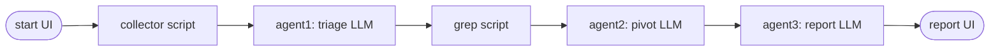

# AMAMA - Multi-Agent DFIR Triage

A lightweight multi-agent system for forensic triage of memory (RAM) images. Built around a deterministic-script + LLM-agent pipeline that keeps token usage low and reduces hallucinations by sandwiching reasoning agents between scripted, evidence-based steps.

> Status: frontend + dummy backend wired end-to-end. The real DFIR pipeline (volatility runner + the three actual LLM agents) is plugged in separately.

## Project layout

```
AMAMA/
  frontend/          React + TypeScript UI (Vite + Tailwind + shadcn/ui)
  backend_dummy/     FastAPI mock backend serving fixture data + SSE stream
  General_Architecturev2.pdf
```

## Pipeline



| Stage | Type | Output |
|---|---|---|
| `start` | UI | file summary + Launch button |
| `collector` | script | image_info, plugins_run, high-level counts |
| `agent1` | LLM | suspicious processes / services / paths / tasks |
| `grep` | script | PID- and path-based pivots into deeper plugins |
| `agent2` | LLM | per-subject verdicts with confidence + evidence refs |
| `agent3` | LLM | 6-section incident narrative |
| `report` | UI | renders agent3 output |

## Quick start

You need **two terminals** running side-by-side.

### 1. Dummy backend (FastAPI)

```bash
cd backend_dummy
python -m venv .venv

# Windows (PowerShell)
.\.venv\Scripts\Activate.ps1
# macOS / Linux
source .venv/bin/activate

pip install -r requirements.txt
uvicorn app.main:app --reload --port 8000
```

Sanity check: <http://localhost:8000/health> -> `{"status":"ok",...}` and Swagger at <http://localhost:8000/docs>.

### 2. Frontend (Vite)

```bash
cd frontend
npm install
npm run dev   # http://localhost:5173
```

Vite proxies `/api/*` and `/health` to <http://localhost:8000>, so the frontend connects to the backend with no extra config.

### 3. Try it

1. Open <http://localhost:5173>.
2. Type a working directory that exists on your machine (the backend reads it for real). Example: `/home/analyst/DFIR_agent`.
3. The page validates the path and shows you any cases discovered under `<workdir>/cases/`. Pick one and click **Open case**.
4. The System View shows the 7-step pipeline on the left. The Start stage lists files found in the case folder.
5. Click **Launch analysis** -> watch each stage light up, progress, and produce a result. Final view is a 6-section incident report.

To experiment without real case folders, just create the structure manually:

```bash
mkdir -p /home/analyst/DFIR_agent/cases/INCIDENT_2025_08_08
echo dummy > /home/analyst/DFIR_agent/cases/INCIDENT_2025_08_08/memory.raw
```

## How the SSE pipeline works

`POST /api/cases/analyze` registers a run and returns a `run_id`. Opening `GET /api/runs/<run_id>/events` starts the run (so it's naturally bound to the subscriber). Each stage emits:

```
{ "type": "stage_start",    "stage": "collector", "kind": "script" }
{ "type": "stage_progress", "stage": "collector", "percent": 41, "message": "Plugin pslist..." }
{ "type": "stage_result",   "stage": "collector", "data": { ... } }
{ "type": "stage_complete", "stage": "collector" }
```

with `run_start` / `run_complete` bookends and an `error` event on failure. The dummy backend paces events with `asyncio.sleep` (~20s total) so the UI animates smoothly.

## Architecture decisions

- **Backend reads the real filesystem** for workspace validation, case listing, and case files. Only the analysis pipeline is faked. This lets analysts point at their actual case folders during development.
- **SSE over WebSocket** because the pipeline is one-way (server -> client). One less moving part.
- **shadcn/ui pattern** instead of a heavy component library: primitives are owned in `frontend/src/components/ui/` and can be tweaked freely.
- **Stage results typed** in `frontend/src/api/stage-results.ts` and pydantic models in `backend_dummy/app/models.py`. These are the canonical contract; the real backend just needs to emit the same shapes.

## Replacing the dummy backend

The real backend just needs to expose the same endpoints. The fixtures in `backend_dummy/app/fixtures.py` describe the exact shapes each stage must produce. The frontend never assumes anything else.

## Files of interest

- `frontend/src/hooks/useAnalysisRun.ts` - the SSE state machine
- `frontend/src/components/pipeline/PipelineStepper.tsx` - left stepper
- `frontend/src/components/pipeline/stages/*` - per-stage panels
- `backend_dummy/app/fixtures.py` - all the fake stage outputs
- `backend_dummy/app/routes/runs.py` - the SSE event emitter

## License

Hackathon project; no license specified yet.
